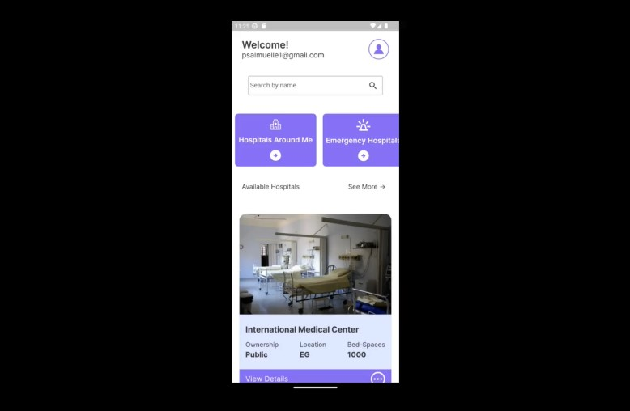

# MedLink Mobile App

A mobile app, built with flutter that connects/Link-up medical facilities globally. This is an MVP for the proposed plaform.



## Getting Started

### Setting up Medlink App

This guide provides instructions for setting up this flutter app. The steps outlined below will assume that you have already installed the Flutter SDK on your machine.

### Prerequisites

Before you begin, you will need the following:

- Github account
- A code editor (such as Visual Studio Code, Android Studio, or IntelliJ IDEA)

### Instructions

1. Fork this github repository.

1. Open your preferred code editor and create a new project.

1. Open a terminal window and navigate to the root directory of your project.

1. Clone the Medlink Flutter app GitHub repository by running the following command:

   ```bash
   git clone https://github.com/psalmuelle/medlink.git
   ```

1. Once the repository has been cloned, navigate to the project directory by running:
   ```bash:
   cd medlink
   ```
1. Run the following command to ensure that all of the app's dependencies are installed:

   ```bash
   flutter pub get
   ```

1. You can now open the project in your code editor. To run the app, use the following command:
   ```bash
   flutter run
   ```

If you encounter any issues, ensure that you have followed all of the necessary steps outlined in the repository's README file. You may also need to troubleshoot any issues with dependencies or configuration settings.

## Conclusion

This guide has provided an overview of the steps required to set up the Medlink Flutter app from a GitHub repository. With the app cloned and dependencies installed, you can now run the app locally on your machine.
